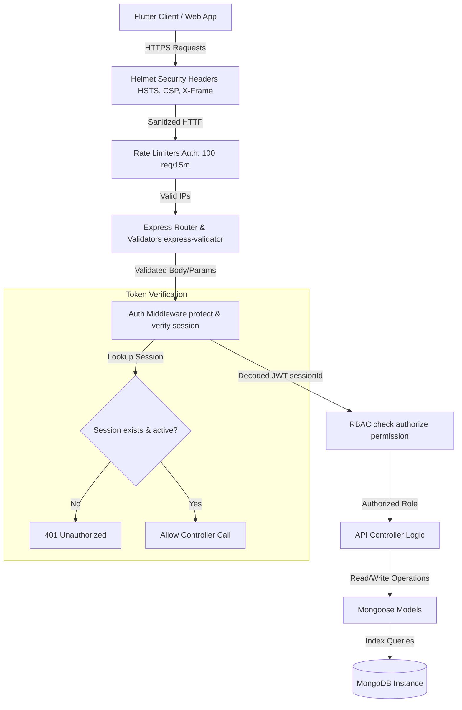
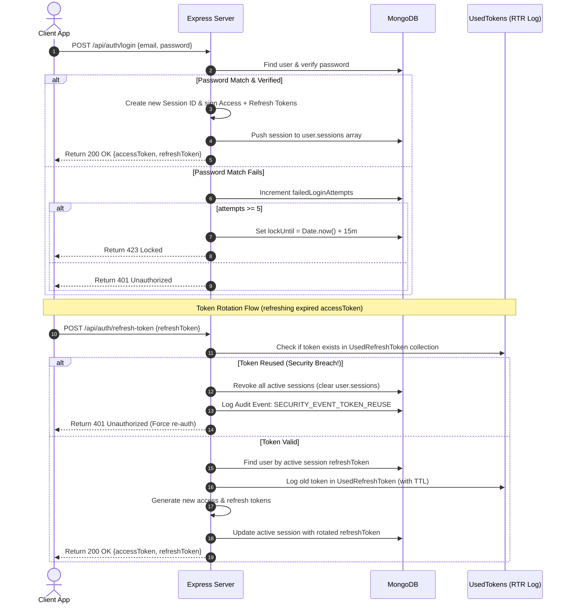
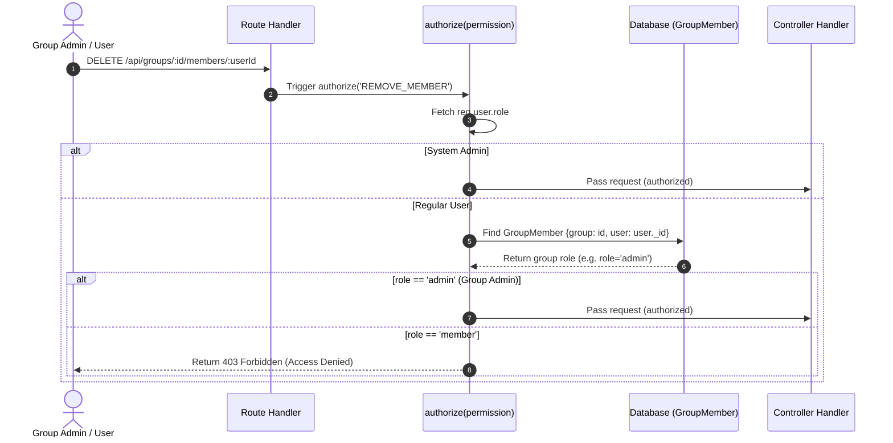

# SplitWise Pro - Migration & Security Architecture Guide

This guide details the security upgrades, the transition to the new database models, sequence flows, and workflows for **SplitWise Pro**.

---

## 1. Database Schema Migrations

### Migrating `User.refreshToken` to `User.sessions`
In the old schema, users only had a single `refreshToken` string. In the new schema, multi-device sessions are stored inside the `sessions` array.

#### Migration Script
Run the following script to migrate existing users in MongoDB to the new session format:

```javascript
// migrate_sessions.js
const mongoose = require('mongoose');
const User = require('./src/models/User');
require('dotenv').config();

const migrate = async () => {
  await mongoose.connect(process.env.MONGODB_URI);
  console.log('Connected to MongoDB.');

  const users = await User.find({ refreshToken: { $ne: null } });
  console.log(`Found ${users.length} users with old refresh tokens.`);

  for (let user of users) {
    if (user.refreshToken && (!user.sessions || user.sessions.length === 0)) {
      user.sessions.push({
        refreshToken: user.refreshToken,
        deviceName: 'Legacy Active Session',
        platform: 'Unknown',
        ipAddress: '0.0.0.0',
        createdAt: new Date(),
        lastUsedAt: new Date(),
        expiresAt: new Date(Date.now() + 7 * 24 * 60 * 60 * 1000) // fallback 7 days
      });
      // Clear the legacy field
      user.set('refreshToken', undefined);
      await user.save();
      console.log(`Migrated user: ${user.email}`);
    }
  }

  console.log('Migration finished successfully.');
  await mongoose.disconnect();
};

migrate().catch(console.error);
```

---

## 2. Security Architecture Diagram
Below is the system security architecture depicting input validation, security headers, token verification, dynamic RBAC, and MongoDB layer data models.



---

## 3. Authentication Sequence Diagram
This diagram shows the login, session generation, and token rotation flow (with Refresh Token Rotation and reuse protection).



---

## 4. Authorization & Permission RBAC Flow
This diagram illustrates the role-based and group-based permission evaluations.



---

## 5. Session Management Workflow
1. **Login**: Client registers/logs in -> Session is added -> JWT contains `sessionId`.
2. **Telemetry**: Client displays all active devices, showing `deviceName`, `platform`, `ipAddress`, and `lastUsedAt`.
3. **Revocation**: Client triggers revoke session -> Backend filters out session from `sessions` list -> Access token with that `sessionId` is immediately invalidated.
4. **Logout All**: Clears all entries in `user.sessions` -> Forcefully logs out all devices.

---

## 6. Admin Panel Workflow
- **Dashboard Telemetry**: Fetches real-time status of dependencies (MongoDB, Redis), host memory usage, and uptime.
- **Security Console**: Counts overall system failed login attempts, locked accounts, OTP abuses, and token reuse attacks.
- **User Activation Control**: Admin disables user -> sets `isDisabled = true`, terminates all active user sessions -> user blocked from making any subsequent API requests.
- **Audit Console**: Paginated audit list of actions (`REGISTER`, `LOGIN`, `LOGOUT`, `SECURITY_EVENT_TOKEN_REUSE`, `ADMIN_ACTION`).
